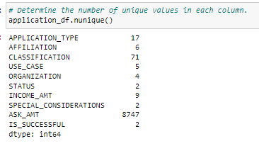
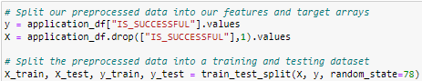
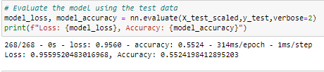
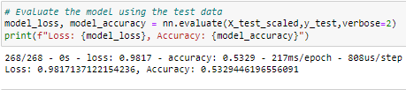
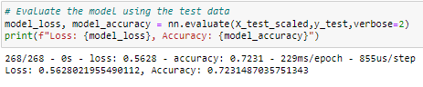

# Neural_Network_Charity_Analysis

# Overview
In this project we are using machiner learning and neural network to help Belks figure out if the applicants will be funded by Alphabet Soup. We were provided a CSV file that cointains 34,000 organizations that have recieved funding from the Alphabet Soup buissness team. Our goal will be to reach above 75% accuracy succes rate for the investment.

# Results
### Proccesing the Data

In the first part we are procesing the data for a neural network model. We start by removing the non-beneficial columns which are EIN and NAME. We then identify our unique values in each column and last we move to spliting and testing our data.  

### Compile, Train and Evaluate the Model
We start by defining the model. Our first we were only able to reach 55% accuracy.  
    1. First hidden layer was set to 80 nueorns    
    2. Seconda hidden layer was set to 30 neurons     
    3. Third hidden layer was set at only 1 neuron

Second attempt we changed our Application_Type values from 500  to 600 and our Classification Values from 1800 down to 1700. We also changed the hiden layer 90,80,1. We reached 53% accutracy which droped us by 2% fomr the first attempt. 

On attempt 3 we were able to reach 72%. We changed Application_Type values from 500  to 900 and our Classification Values from 1800 up to 2000. We also made changed in our hidden node layers 82,32,1. 

# Summary

After many attempts it seemd that 72% was the highest we could reach. We did not meet our 75% goal but we did lower the loss with attempt 3 down to 56%. 